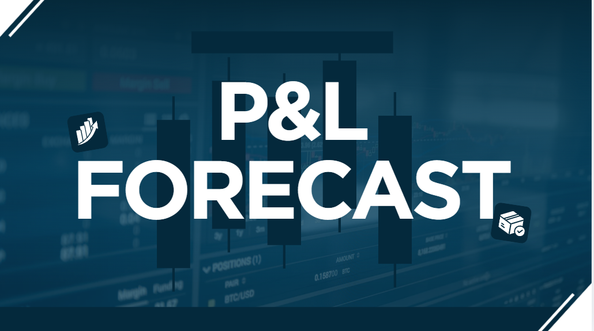

# Profit & Loss Forecasting Model (Excel + Data Analysis Project)


## Project Overview

This project is a financial analysis and forecasting model built in Excel to evaluate business performance from **2022–2024** and project future growth.
It focuses on breaking down revenue, costs, and operating expenses while incorporating forecasting assumptions such as growth rate, investor expectations, and market share expansion.

## Objectives
* Analyze historical financial performance (Revenue, Costs, Profitability)
* Build a structured Profit & Loss (P&L) statement
* Forecast future revenue using multiple business assumptions
* Understand cost drivers and operational efficiency
* Support strategic decision-making with data

## Business Problem
Businesses need to:
* Understand where money is coming from and where it is going
* Control rising operational costs
* Predict future growth based on realistic assumptions

## Model Breakdown

### 1. Revenue Analysis
* Historical revenue growth tracked across 2022–2024
* Growth trends analyzed (93%, 47%, etc.)
* Forecasted 2025 revenue based on weighted assumptions

### 2. Cost of Goods Sold (COGS)
* Includes:
  * Cost of goods
  * Expired materials
* Average cost ratio maintained (~53%)

### 3. Gross Profit
* Calculated as:
```text
Gross Profit = Revenue - COGS
```
* Margin maintained around **45%–47%**

### 4. Operating Expenses (OPEX)
Detailed breakdown of:
####  Selling & Marketing
* Salaries & Wages
* Benefits
* Digital Marketing
* Marketing Events
####  Research & Development
* Salaries
* Software
* Benefits
####  General & Administrative
* Rent
* Travel
* Legal Fees
* Accounting Fees
* Utilities

### 5. Profitability Metrics
* **EBITDA** (Operating performance)
* **Net Income** (Final profitability after all costs)
Insight: Business is currently operating at a **loss**, indicating high growth investment phase.

##  Forecasting Approach
Revenue forecast is based on 3 key drivers:

### A. Historical Growth Trend
* Based on past performance

### B. Investor Expectations
* Assumed growth pressure from stakeholders

### C. Market Opportunity
* Based on total addressable market and expansion potential

```text
Final Forecast Growth Rate = Average of all 3 factors
```

This directly drives revenue projections.

##  Key Insights
* Revenue is growing rapidly but slowing over time
* Cost of goods remains stable as a % of revenue
* Operating expenses are increasing significantly
* Business is prioritizing growth over profitability

##  Business Recommendations
* Optimize marketing spend efficiency
* Control administrative cost growth
* Scale revenue faster than operating expenses
* Focus on improving EBITDA margin over time

## Tools Used
* Microsoft Excel (Financial Modeling)
* Data Analysis Techniques
* Forecasting & Scenario Planning

##  Future Improvements
* Convert model into Power BI dashboard
* Automate forecasting using Python
* Add scenario analysis (best case / worst case)


## Author
**Cecilia Ojile**
Data Analyst | Financial Analysis | SQL | Excel


## If you found this useful
Give this repo a star and share feedback!
